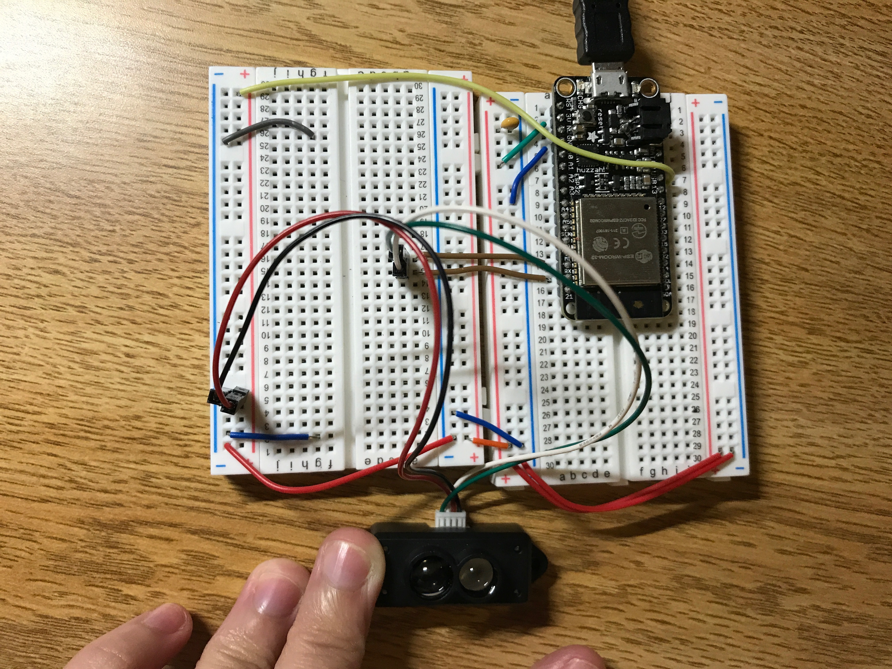

#  LIDAR

Author: Ellen Lo, 2018-10-18

## Summary
In this skill assignment, I was able to get distance measurement with a lidar. Since it is a serial device, I used UART to get data from the sensor and store it in a 256 byte buffer. The buffer locates header bytes(0x59, 0x59) and parsed following bytes for the distance values.

## Sketches and Photos
### Wiring

Lidar uses 5V power (from usb out), transmitter TX and receiver RX pins.

## Modules, Tools, Source Used in Solution
-[esp-idf uart example](https://github.com/espressif/esp-idf/tree/affe75a10250564353d088f6b9a74dbb6f1ea0df/examples/peripherals/uart_echo)

-[Lidar datasheet](https://cdn.sparkfun.com/assets/5/e/4/7/b/benewake-tfmini-datasheet.pdf)

## Supporting Artifacts
-[Video Demo](https://youtu.be/K9_Y9Q__5sY)
