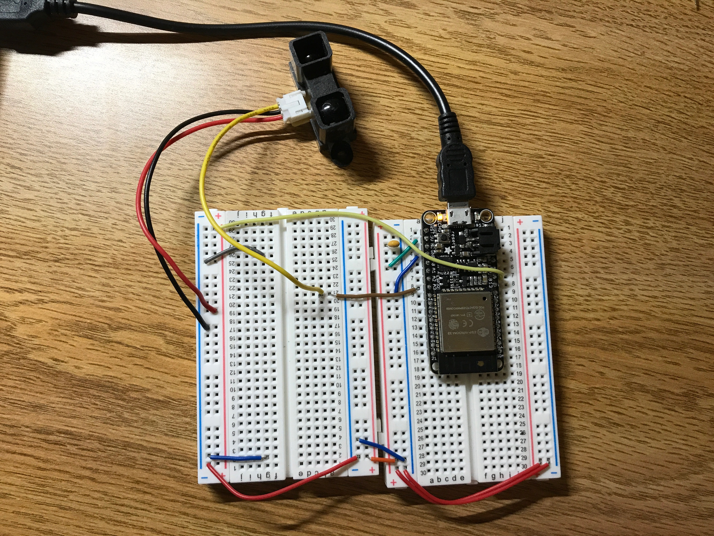

#  IR Rangefinder

Author: Ellen Lo, 2018-10-12

## Summary
In this skill assignment, I was able to get distance measurement with IR rangefinder. I chose to read analog outputs in this demo. From the graph of voltage reading against object distance on datasheet, I calculated an estimate of distance based on the given curve. Also, the range given on datasheet is 20cm to 150cm, so distances below 20cm are not as accurate, as shown in the video.

## Sketches and Photos
### Wiring

IR Rangefinder uses 5v power and its data signal line is connected to GPIO 39 / A3.

## Modules, Tools, Source Used in Solution
-[esp-idf adc example](https://github.com/espressif/esp-idf/tree/affe75a10250564353d088f6b9a74dbb6f1ea0df/examples/peripherals/adc)

-[IR Range Finder Specs](https://www.sparkfun.com/datasheets/Sensors/Infrared/gp2y0a02yk_e.pdf)

## Supporting Artifacts
-[Video Demo](https://youtu.be/AMLHHe7dRkk)
