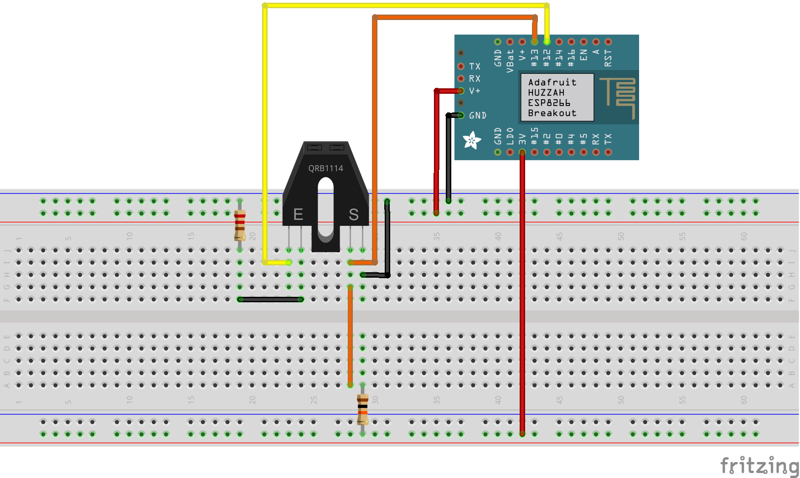
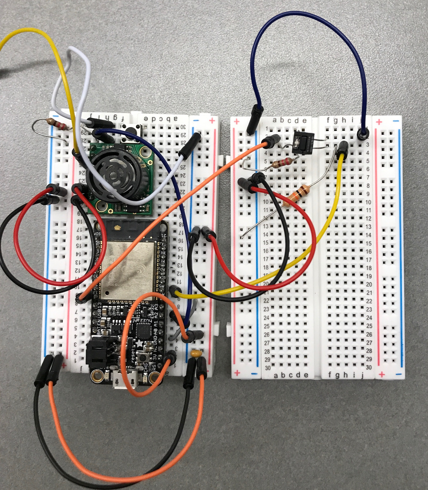
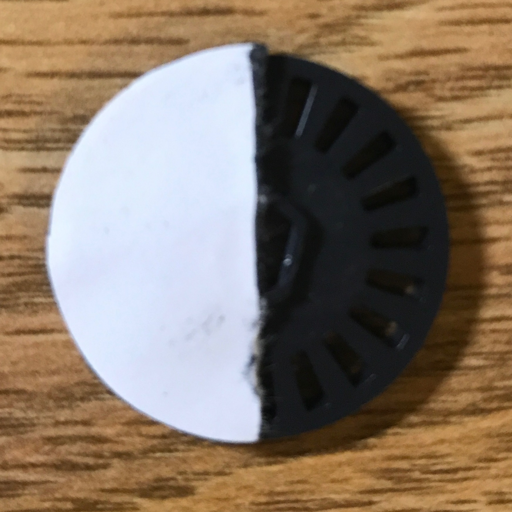

#  Wheel sensor

Author: Ellen Lo, 2018-10-12

## Summary
In this skill assignment, I was able to get wheel speed with optical detector. Because it is able to detect white but not black, I attached a piece of white paper to half of the wheel. My program reads analog-to-digital value, thresholds the reading into LOW and HIGH, and measures the time it takes from one to next rising edge.

## Sketches and Photos
### Wiring

(Note that GPIO 27 is used instead of GPIO 13.)
Optical detector consists of an infrared LED and a phototransistor. LED is wired to GPIO 12 and grounded through 220 ohm resistor, and phototransistor is powered via 3v power through 10K ohm resistor, connected to GPIO 27 to read adc reading, and grounded.

### Wheel half-covered with white paper

## Modules, Tools, Source Used in Solution
-[esp-idf adc example](https://github.com/espressif/esp-idf/tree/affe75a10250564353d088f6b9a74dbb6f1ea0df/examples/peripherals/adc)

-[Sparkfun guide on optical detector](https://learn.sparkfun.com/tutorials/qrd1114-optical-detector-hookup-guide#example-circuit)

## Supporting Artifacts
-[Video Demo]()
