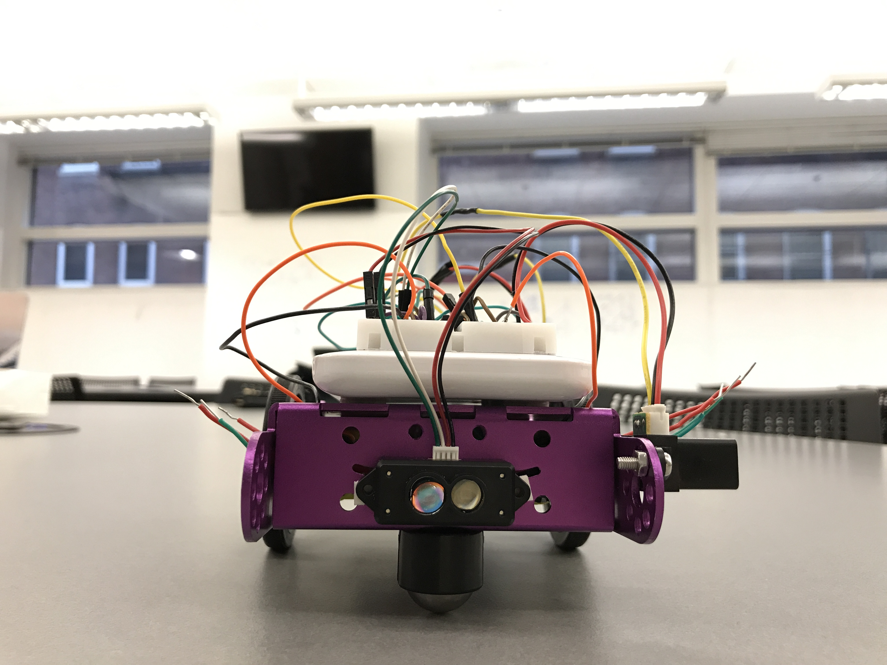
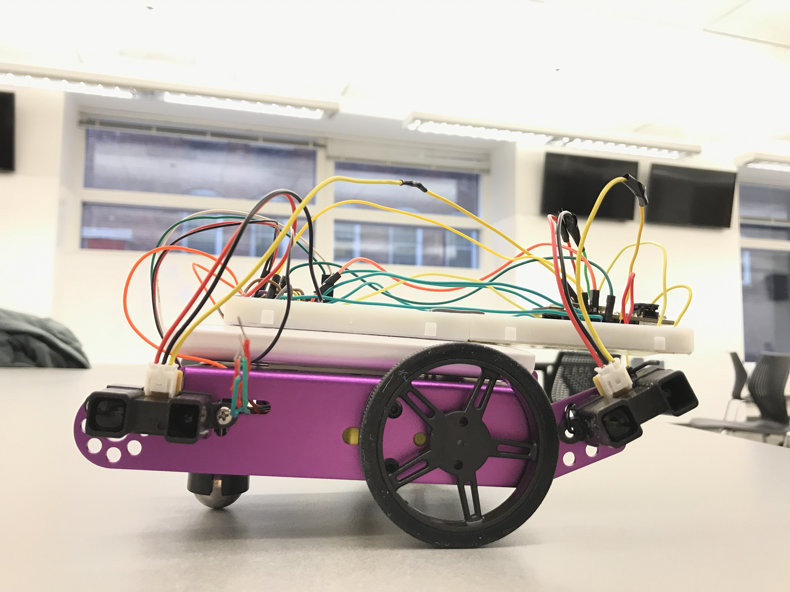
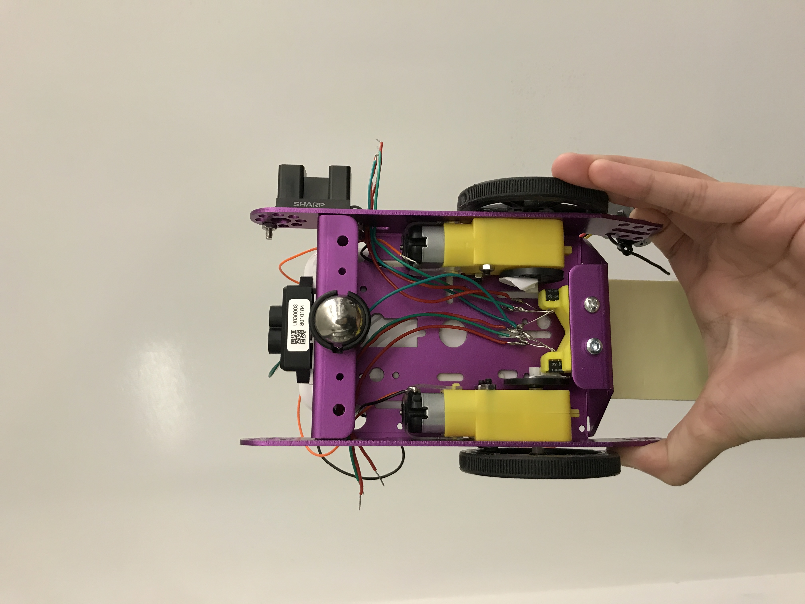
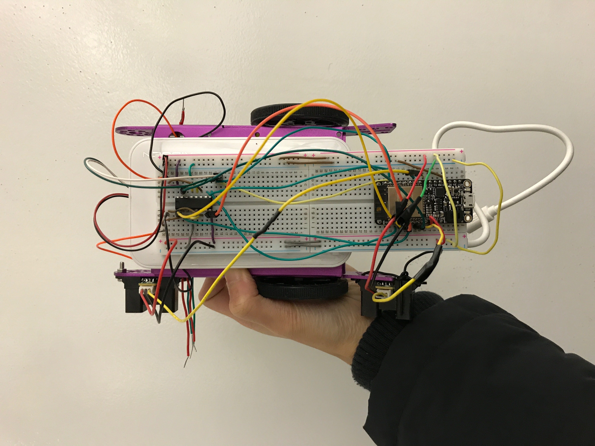

# Self-driving car
Author: Ellen Lo, Lin Ma, Biyao Liang, 2018-11-16

## Summary
In this quest, we used proximity sensor and IR TX/RX skills to control and enable car to self drive around a course.

## Evaluation Criteria
We decided on the following specifications for a successful solution to this quest:
- Able to take distance reading with IR range finder and LiDAR
- Drives straight by default and turns left when distance from front wall is lower than a certain threshold
- Corrects error when car deviates from driving straight
- Gets signals from beacons to identify which station the car is close to

## Solution Design
We used IR range finders and LiDAR to get distance readings, H-bridge to drive two dc motors attached to wheel, and IR transmit beacon to receive signals from IR LEDs. The pins used are:
- IR range finder (front): GPIO #13
- IR range finder (back): GPIO #39
- LiDAR: TX and RX pins
- IR beacon: GPIO #26 and #34
- DC motor (left): GPIO #15, #33, and #32 (EN)
- DC motor (right): GPIO #27, #4, #14 (EN)

Regarding the sensing aspect of the self-driving car, it is capable of sensing its distance from front wall with LiDAR sensor as well as distance from right wall with 2 IR range finders. The car motion control has 2 modes: drive straight (default) and turn left. The mode switches from default, which is driving straight, to turn left if distance from LiDAR is smaller than a threshold of 20cm. 

The first mode (drive straight) has PID control integrated to prevent car from deviating from its straight track. It compares the distance measured from right wall by IR range finders, one mounted on the front and another at the back. We detect deviation by checking if the difference between two values are not the same. Then we correct the deviation by adjusting the speed of right wheel while keeping the speed of left wheel constant. If the front is further away from the wall than the back, we increase speed of right wheel. If the back is further away from the wall than the front, we decrease speed of right wheel.

To find out which corner / station the car is approaching, we get signals from the beacons. The corresponding LED light up based on the ID received from beacon.

## Sketches and Photos
Front

## Links
-[Video demo of car traveling with pid control](https://youtu.be/Xkk5WmReC2Y)

Right

Back

Top

## Modules, Tools, Source Used in Solution
-[PID skill on whizzer.bu.edu](http://whizzer.bu.edu/individual-assignments/5-cyberphysical/pid)

## Supporting Artifacts
